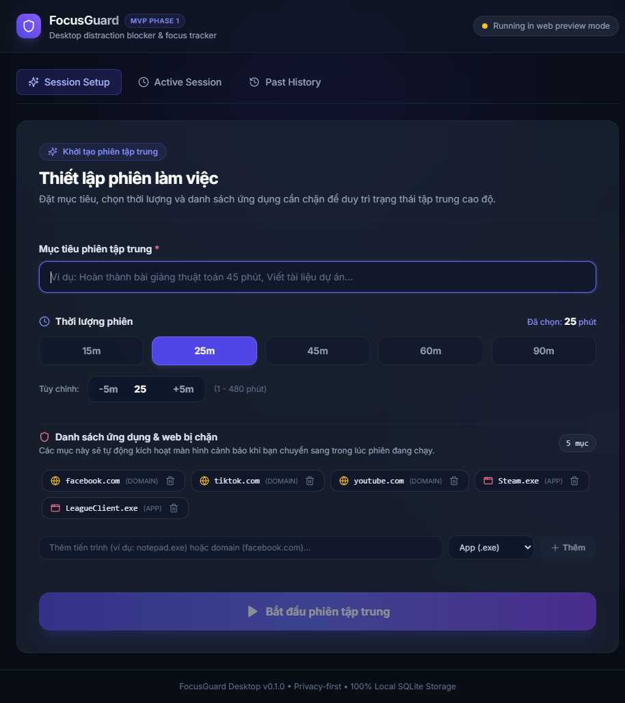
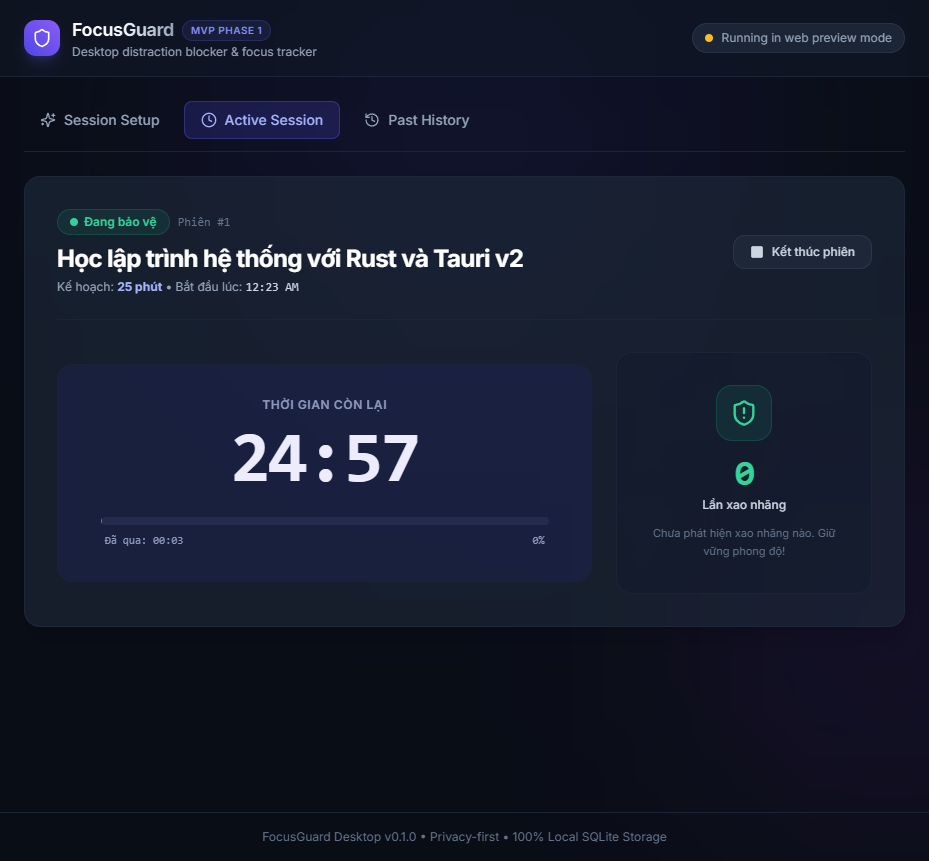
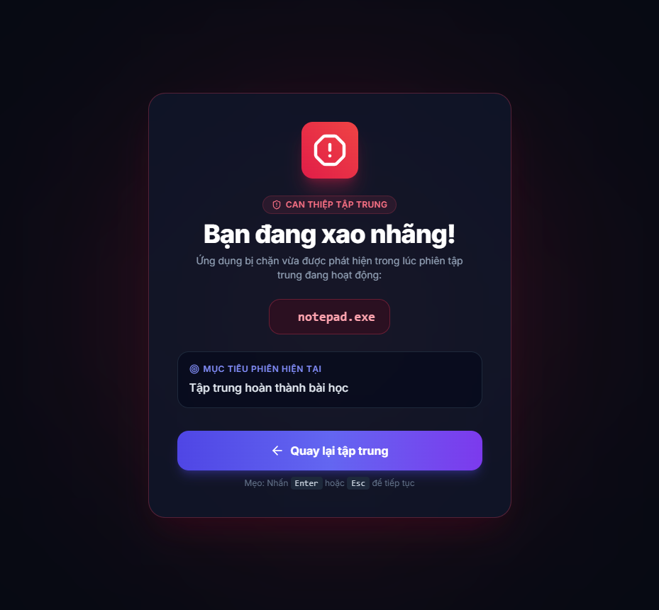
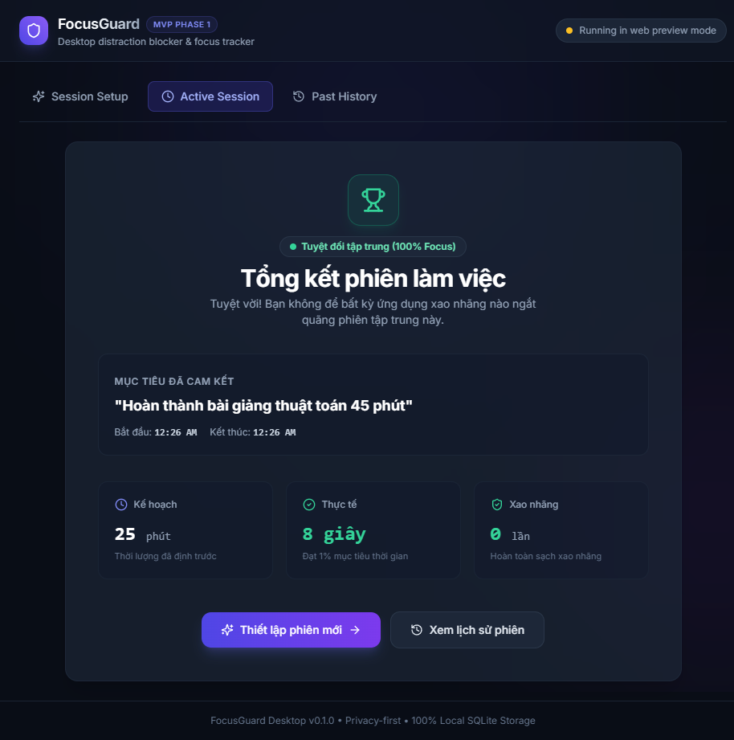
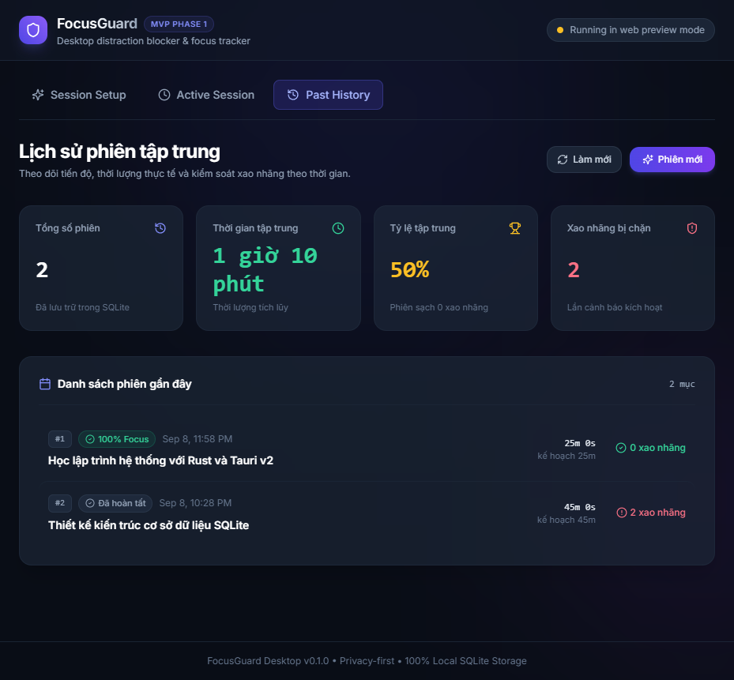

# FocusGuard 🛡️

[](LICENSE)
[](https://v2.tauri.app/)
[](https://www.rust-lang.org/)
[](https://react.dev/)
[](https://www.typescriptlang.org/)
[](https://tailwindcss.com/)
[](https://www.sqlite.org/)
[](#privacy-first-philosophy)

> **FocusGuard** is an open-source, local-first desktop application built with **Tauri v2, Rust, React, and SQLite** that helps you eliminate digital distractions during self-set focus sessions.

When you start a session, FocusGuard actively monitors foreground processes and active windows in the background. If you switch to a blacklisted game, social media app, or distracting tool, FocusGuard instantly triggers an **always-on-top, full-screen intervention overlay** to remind you of your goal and redirect your focus.

---

## 📸 Visual Showcase

### 1. Session Setup & Blacklist Manager
Set your session goal, choose planned durations (presets or +/-5m stepper), and customize your blacklisted applications (`.exe`) and web domains.



---

### 2. Active Focus Session Timer
High-visibility live digital countdown, animated progress bar, and real-time distraction counter connected to the Rust background poller.



---

### 3. Distraction Warning Overlay
Always-on-top, full-screen glassmorphic intervention window triggered the instant an offending process is detected.



---

### 4. Post-Session Summary
Planned vs. actual focus time comparison, completion efficiency, and achievement accolades (100% Clean Focus Trophy).



---

### 5. Past Sessions History Dashboard
Cumulative productivity metrics (total focus hours, clean session rate, distractions prevented) and detailed session logs stored locally in SQLite.



---

## ⚡ Key Features

- 🎯 **Goal-Oriented Focus Sessions**: Commit to a specific task and planned duration (15m, 25m, 45m, 60m, 90m, or custom).
- 🦀 **Native Rust Background Poller**: Independent background polling loop (`tokio::time::interval`, 1–2s) monitoring active foreground windows via native OS APIs (`GetForegroundWindow`, `GetWindowThreadProcessId`, `GetModuleBaseNameW`).
- 🛡️ **Instant Friction & Warning Overlay**: Always-on-top, borderless overlay window immediately summons attention when distraction occurs.
- ⏱️ **Distraction Debouncer**: Intelligently suppresses repeat triggers within a 5-second window so you aren't spammed while closing the app.
- 📊 **Local-First SQLite Storage**: All sessions, distraction timestamps, and blacklist rules persist locally in `%APPDATA%/com.focusguard.app/focusguard.db`.
- 🔒 **Zero Telemetry / 100% Offline**: No accounts, no network calls, no cloud tracking. Complete privacy by design.

---

## 🏗️ Architecture & How It Works

```
┌─────────────────────────────────────────────────────────────┐
│                      React Frontend                         │
│   SessionSetup  •  SessionTimer  •  OverlayWarning  •  Dashboard   │
└──────────────┬───────────────────────────────▲──────────────┘
               │ Tauri IPC Invoke              │ Tauri Events ("distraction-detected")
┌──────────────▼───────────────────────────────┴──────────────┐
│                    Rust Backend (Tauri v2)                  │
│                                                             │
│   commands.rs           db.rs            process_monitor.rs │
│  (IPC Handlers)  (SQLite Data Layer)   (Tokio Background)   │
│                          │                      │           │
│                          ▼                      ▼           │
│                 [ focusguard.db ]       [ Win32 OS APIs ]   │
│                 (sessions, blacklist,  (GetForegroundWindow │
│                     distractions)       GetModuleBaseName)  │
└─────────────────────────────────────────────────────────────┘
```

1. **Window Monitoring**: `process_monitor.rs` runs on a background Tokio task. Every 1.5s, it queries Windows native APIs to resolve the active executable.
2. **Debouncing**: `DistractionDebouncer` checks if the offending process has been logged within the last 5 seconds.
3. **Multi-Window Control**: On detection, Rust instructs the pre-created transparent overlay window to show, focus, and remain always-on-top while emitting `"distraction-detected"` event to update the UI.

---

## 🚀 Getting Started

### Prerequisites

1. **Node.js**: v18+ and `pnpm` (`npm install -g pnpm`)
2. **Rust**: `rustup` with MSVC toolchain (`stable-x86_64-pc-windows-msvc`)
3. **C++ Build Tools**: Visual Studio 2022 Build Tools with the **Desktop development with C++** workload and Windows SDK.

---

### Installation & Development

```bash
# 1. Clone the repository
git clone https://github.com/Nhanduc2912/Focusguard.git
cd focusguard

# 2. Install frontend dependencies
pnpm install

# 3. Run frontend unit tests (Vitest)
pnpm test

# 4. Run backend unit & integration tests (Cargo)
cd src-tauri
cargo test
cd ..

# 5. Start the Tauri development desktop app
pnpm tauri dev
```

---

### Running Automated Quality Gates

```bash
# Frontend typecheck & build
pnpm build

# Rust linter (must pass with 0 warnings)
cd src-tauri
cargo clippy --all-targets -- -D warnings

# End-to-End integration test (targets real SQLite DB)
cargo test --test verify_e2e -- --nocapture
```

---

### Building for Production

To create a standalone production Windows installer or executable:

```bash
pnpm tauri build
```

The compiled binary and NSIS installer will be generated in `src-tauri/target/release/`.

---

## 🔒 Privacy-First Philosophy

FocusGuard is designed around uncompromising privacy:
- **No Analytics or Telemetry**: No tracking scripts, no third-party telemetry libraries.
- **100% Offline**: Operates fully disconnected from the internet.
- **Local SQLite DB**: Your focus history and distraction statistics never leave your device.

---

## 📜 License

Distributed under the [MIT License](LICENSE). Free for personal and commercial use.
